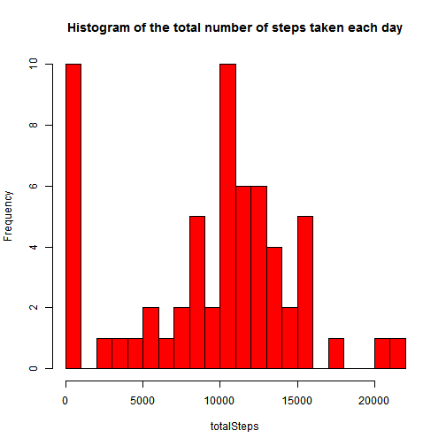
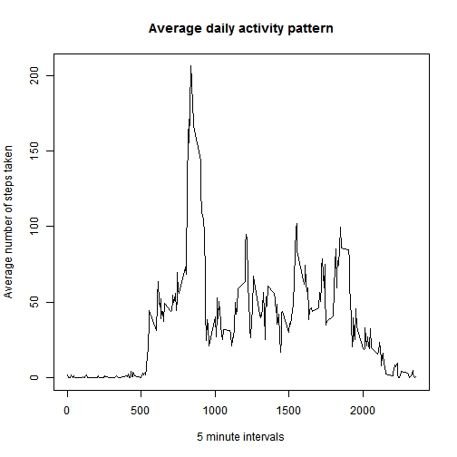
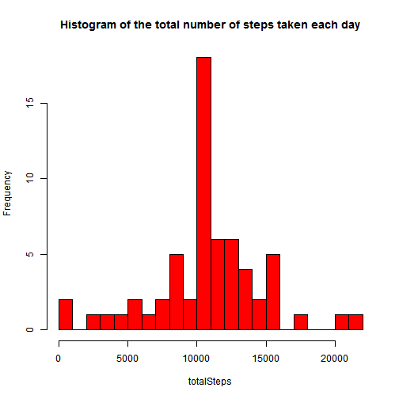
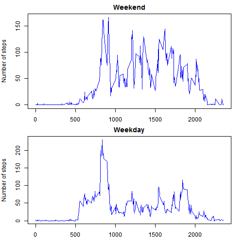

# Reproducible Research: Peer Assessment 1

## Loading and preprocessing the data

```r
setwd("C:/Users/Alex/Documents/R")  ## Modify as needed
data <- read.csv("activity.csv")
numRecords <- dim(data)[1]
```


## What is mean total number of steps taken per day?


```r
FirstDay <- as.Date(data$date[1])
LastDay <- as.Date(data$date[numRecords])
numDays <- as.numeric(LastDay - FirstDay) + 1
totalSteps <- 1:numDays
for (i in 1:numDays) {
    totalSteps[i] <- sum(data$steps[data$date == as.character(FirstDay - 1 + 
        i)], na.rm = TRUE)
}
hist(totalSteps, breaks = 20, main = paste("Histogram of the total number of steps taken each day"), 
    col = "Red")
```

 

We see that there were 10 days with less than a thousand steps, and 2 days with more than 20 thousand steps.  
Now let's calculate the mean and median total number of steps taken per day:

```r
mean(totalSteps, na.rm = TRUE)
```

```
## [1] 9354
```

```r
median(totalSteps, na.rm = TRUE)
```

```
## [1] 10395
```

Thus 9354 steps per day on average, and the median is 10395 steps.

## What is the average daily activity pattern?


```r
intervals <- unique(data$interval)
numIntervals <- length(intervals)
averageStepsPerInterval <- 1:numIntervals
for (i in 1:numIntervals) {
    averageStepsPerInterval[i] <- mean(data$steps[data$interval == intervals[i]], 
        na.rm = TRUE)
}
plot(averageStepsPerInterval ~ intervals, type = "l", xlab = "5 minute intervals", 
    ylab = "Average number of steps taken", main = "Average daily activity pattern")
```

 


Which 5-minute interval, on average across all the days in the dataset, contains the maximum number of steps?

```r
intervals[averageStepsPerInterval == max(averageStepsPerInterval)]
```

```
## [1] 835
```

So, it's the interval 8:35:00 ... 8:39:59.

## Imputing missing values
The total number of NA (missing values) in the dataset:

```r
sum(is.na(data$steps))
```

```
## [1] 2304
```

Each missing value, is replaced by the mean (across all days) for the corresponding 5-minute interval:

```r
data2 <- data
for (i in 1:numRecords) {
    if (is.na(data$steps[i])) {
        data2$steps[i] <- averageStepsPerInterval[intervals == data$interval[i]]
    }
}
```

Let's again make a histogram of the total number of steps taken each day, and then  
calculate and report the mean and median total number of steps taken per day.

```r
totalSteps <- 1:numDays
for (i in 1:numDays) {
    totalSteps[i] <- sum(data2$steps[data2$date == as.character(FirstDay - 1 + 
        i)])
}
hist(totalSteps, breaks = 20, main = paste("Histogram of the total number of steps taken each day"), 
    col = "Red")
```

 

```r

mean(totalSteps)
```

```
## [1] 10766
```

```r
median(totalSteps)
```

```
## [1] 10766
```

Both values are higher, and this time the mean is equal to the median.  
Another impact of imputing missing data on the estimates of the total daily number of steps is that, as we see from the histogram, the mode is much higher, and there were only 2 days with less than a 1000 steps, versus 10 days before imputing.

## Are there differences in activity patterns between weekdays and weekends?
Yes, there are huge differences:

```r
averageStepsPerInterval_Weekend <- 1:numIntervals
averageStepsPerInterval_Weekday <- 1:numIntervals
ad <- as.Date(data$date)
weekend <- (weekdays(ad) == "Sunday" | weekdays(ad) == "Saturday")
for (i in 1:numIntervals) {
    averageStepsPerInterval_Weekend[i] <- mean(data2$steps[data$interval == 
        intervals[i] & weekend])
    averageStepsPerInterval_Weekday[i] <- mean(data2$steps[data$interval == 
        intervals[i] & !weekend])
}
shutup <- split.screen(c(2, 1))
screen(1)
par(mar = c(2, 4, 2, 2))
plot(averageStepsPerInterval_Weekend ~ intervals, type = "l", xlab = "interval", 
    ylab = "Number of steps", main = "Weekend", col = "Blue")
screen(2)
par(mar = c(3, 4, 2, 2))
plot(averageStepsPerInterval_Weekday ~ intervals, type = "l", xlab = "interval", 
    ylab = "Number of steps", main = "Weekday", col = "Blue")
```

 

```r
## close.screen(all.screens = TRUE)
```

